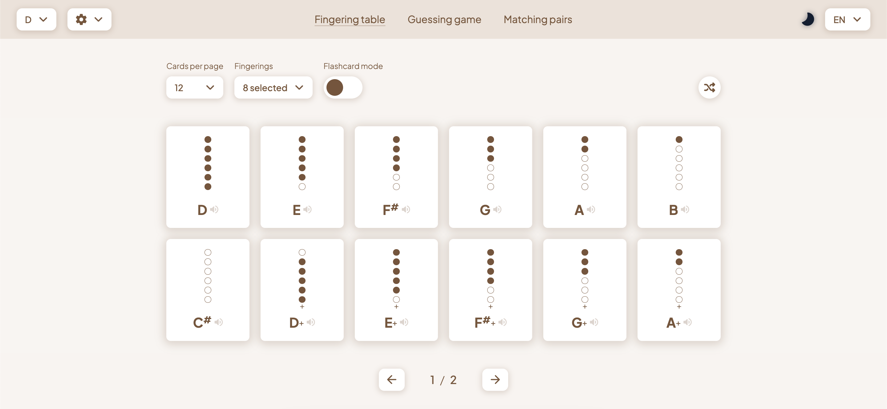
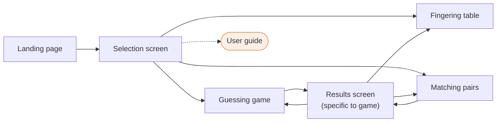

# Whistle Buddy

 

This app was created to help beginner Irish Whistle players kickstart their learning with 3 interactive tools centred around memorising the fingerings, which is the first step towards playing all of your favourite tunes.

## Table of Contents
- [Live app](#live-app)
- [Architecture](#architecture)
  - [User Flow Diagram](#user-flow-diagram)
- [Features](#features)
- [Technologies Used](#technologies-used)
- [Getting Started](#getting-started)
  - [Prerequisites](#prerequisites)
  - [Installation](#installation)
- [Usage](#usage)
- [Testing](#testing)
- [Contributing](#contributing)
- [License](#license)
- [Contact](#contact)

## Live app

You can find the Whistle Buddy app here:

- [Live App](http://whistle-buddy.com)

## Architecture

### User Flow Diagram

## Features

- Interactive card table with playable notes, flashcard mode, granular fingering selection and more
- Multiple choice quiz game
- Matching pairs card game
- Dark mode for late night studying sessions
- Progressive Web App: you can install this app directly on your computer or phone!

## Technologies Used

- [Vue.js](https://vuejs.org/) - JavaScript framework
- [Vite](https://vitejs.dev/) - Module bundler / Build tool
- [TypeScript](https://www.typescriptlang.org/) - Programming language
- [Vue Router](https://router.vuejs.org/) - Routing library
- [Pinia](https://pinia.vuejs.org/) - State management library
- [Vitest](https://vitest.dev/) - Testing framework
- [Vue i18n](https://kazupon.github.io/vue-i18n/) - Internationalisation plugin

## Getting Started

### Prerequisites

- [Node.js](https://nodejs.org/) v16.0+ and NPM v8.0+

### Installation

1. Clone the repository
`git clone https://github.com/petitchampi/whistle-buddy.git`
2. Change to the project directory
`cd whistle-buddy`
3. Install dependencies
`npm install`
4. Start the development server
`npm run dev`
5. Access the application at `http://127.0.0.1:5173/`

## Usage

Once you've opened the app, our mascot will welcome you and explain how to get around!
 

## Testing

For unit and component tests, run `npm run test:unit`

## Contributing

This project is open-source, which means you can submit your own code suggestions. Here's how to do it:

1. Fork the project
2. Create your feature branch (`git checkout -b feature/AmazingFeature`)
3. Commit your changes (`git commit -m 'Add some AmazingFeature'`)
4. Push to the branch (`git push origin feature/AmazingFeature`)
5. Open a pull request

## License

This project is licensed under the MIT License. See the [LICENSE](LICENSE) file for details.

## Contact

For any questions, bug reports or suggestions:  
Esther Bauzou (Developer and designer) - esther@whistle-buddy.com

Project Link: https://github.com/petitchampi/whistle-buddy